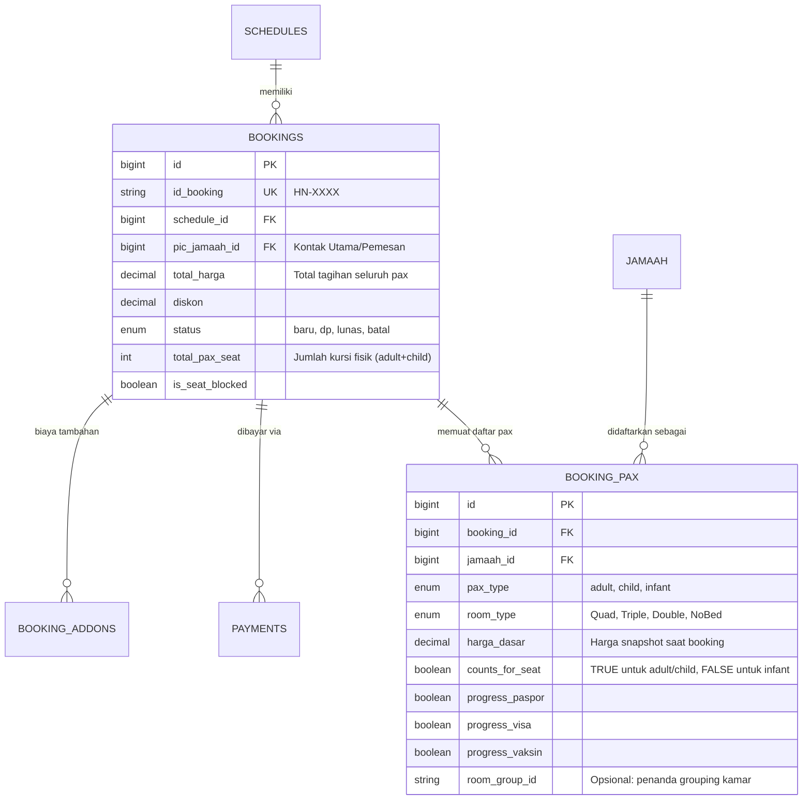

# ANALISIS KEMAMPUAN MODEL DATA BOOKING: MULTI-JAMAAH, INFANT, DAN KOMBINASI KAMAR

**Dokumen**: `ANALISA-multi-jamaah-booking.md`  
**Status**: Riset Teknis & Rekomendasi Desain Arsitektur (Pure Analysis — No Code/Schema Changes)  
**Acuan Kode**: Codebase aktual `erp-azhan` (Backend Go, MySQL Migrations 001–039, Frontend React Shared & Dashboards)

---

## 1. Kesimpulan Singkat

| Skenario | Status Dukungan | Alasan Teknis Singkat |
|---|---|---|
| **1. Multi-Jamaah dalam 1 Booking** (Keluarga 4 orang dalam 1 transaksi/invoice) | **TIDAK DIDUKUNG** | Relasi tabel `bookings.jamaah_id` adalah *single foreign key* (1:1 per baris). Satu booking hanya merepresentasikan satu orang jamaah. Pengurangan kuota kursi di backend di-hardcode `-1` per booking, dan form UI hanya menyediakan satu dropdown pemilih jamaah. |
| **2. Booking dengan Infant (Bayi)** (Mempengaruhi harga via `harga_infant`, tanpa alokasi kursi/kamar) | **TIDAK DIDUKUNG** | Kolom `schedules.harga_infant` hanya ada sebagai data pasif/katalog. Enum `bookings.room_type` dan handler backend menolak nilai selain `Quad/Triple/Double`. Tabel `jamaah` dan `bookings` tidak memiliki penanda kategori usia (`pax_type`/`is_infant`), serta alur pemotongan kursi tidak dapat membedakan penumpang yang butuh vs tidak butuh kursi pesawat. |
| **3. Kombinasi Tipe Kamar Berbeda dalam 1 Booking** (Misal 4 pax: 2 Quad + 2 Double) | **TIDAK DIDUKUNG** | Kolom `bookings.room_type` adalah *single scalar* per baris booking. `harga_dasar` dan `total_harga` dihitung dari satu harga kamar tunggal. Tidak ada struktur *itemized breakdown* harga per-pax dalam satu transaksi booking. |

---

## 2. Bukti Teknis dari Codebase

### 2.1 Struktur Skema Database & Migrasi
1. **Single Foreign Key Jamaah pada `bookings`**:
   - Di [`migrations/013_jamaah_booking.sql:31-43`](file:///c:/laragon/www/erp-azhan/migrations/013_jamaah_booking.sql#L31-L43):
     ```sql
     CREATE TABLE bookings (
       id            BIGINT UNSIGNED AUTO_INCREMENT PRIMARY KEY,
       schedule_id   BIGINT UNSIGNED NOT NULL,
       jamaah_id     BIGINT UNSIGNED NOT NULL,
       room_type     ENUM('Quad','Triple','Double') NOT NULL,
       ...
       FOREIGN KEY (schedule_id) REFERENCES schedules(id),
       FOREIGN KEY (jamaah_id) REFERENCES jamaah(id)
     );
     ```
   - Tidak ditemukan tabel relasi many-to-many atau tabel perantara seperti `booking_jamaah` atau `booking_pax` di seluruh migrasi (001–039).

2. **Ketiadaan Konsep `seat_quota_id` / Kuota Per Tipe Kamar**:
   - Di [`migrations/001_init.sql:41-42`](file:///c:/laragon/www/erp-azhan/migrations/001_init.sql#L41-L42), kuota disimpan sebagai single total pool pada jadwal: `seat_total INT`, `seat_sisa INT`.
   - Tidak ada tabel terpisah `seat_quotas`. Satu baris jadwal membagi kuota kursi secara flat untuk semua tipe kamar.

3. **Status Kolom `harga_infant` pada Jadwal**:
   - Di [`migrations/033_schedule_harga_infant.sql:1`](file:///c:/laragon/www/erp-azhan/migrations/033_schedule_harga_infant.sql#L1):
     `ALTER TABLE schedules ADD COLUMN harga_infant DECIMAL(12, 2) NULL AFTER harga_double;`
   - Kolom ini hanya ditambahkan ke tabel `schedules`, namun **TIDAK PERNAH** diintegrasikan ke tabel `bookings` ataupun modul kalkulasi booking.

---

### 2.2 Model & Repository Backend (Golang)
1. **Asumsi 1:1 pada Model Go**:
   - Di [`internal/booking/model.go:17-50`](file:///c:/laragon/www/erp-azhan/internal/booking/model.go#L17-L50):
     Struct `Booking` memegang `JamaahID int64`, `NamaJamaah string`, `RoomType string`, dan `HargaDasar *float64`.
   - Struct `CreateBookingRequest` ([`internal/booking/model.go:54-60`](file:///c:/laragon/www/erp-azhan/internal/booking/model.go#L54-L60)) hanya menerima single `JamaahID` dan single `RoomType`.

2. **Validasi Enum dan Penolakan Infant**:
   - Di [`internal/booking/handler.go:25-29`](file:///c:/laragon/www/erp-azhan/internal/booking/handler.go#L25-L29):
     ```go
     var validRoomTypes = map[string]bool{
         "Quad":   true,
         "Triple": true,
         "Double": true,
     }
     ```
   - Di [`internal/booking/repository.go:537-559`](file:///c:/laragon/www/erp-azhan/internal/booking/repository.go#L537-L559) (`GetScheduleHarga`):
     Fungsi ini melakukan `switch roomType` hanya untuk `Quad`, `Triple`, dan `Double`. Pengiriman `Infant` atau tipe lain akan mengembalikan error runtime `"room_type tidak valid"`.

3. **Logika Pengurangan Kuota Kursi yang Bersifat Hardcoded Satuan**:
   - Di [`internal/booking/repository.go:320-321`](file:///c:/laragon/www/erp-azhan/internal/booking/repository.go#L320-L321):
     `UPDATE schedules SET seat_sisa = seat_sisa - 1 WHERE id=?`
   - Di [`internal/booking/repository.go:307-308`](file:///c:/laragon/www/erp-azhan/internal/booking/repository.go#L307-L308):
     `UPDATE schedules SET seat_sisa = seat_sisa + 1 WHERE id=?`
   - Sistem mengasumsikan secara mutlak bahwa 1 transaksi booking = 1 kursi fisik pesawat.

4. **Kalkulasi Total Harga Tanpa Rincian Pax**:
   - Di [`internal/booking/repository.go:381-386`](file:///c:/laragon/www/erp-azhan/internal/booking/repository.go#L381-L386):
     `total_harga = GREATEST(0, COALESCE(harga_dasar, 0) + SUM(booking_addons.nominal) - diskon)`
   - Formula ini murni menghitung 1 unit kamar + add-on per-booking - diskon. Tidak ada formula berbasis jumlah pax (`SUM(harga_pax)`).

5. **Progress Keberangkatan Terikat pada 1 Jamaah**:
   - Di [`internal/booking/repository.go:594-606`](file:///c:/laragon/www/erp-azhan/internal/booking/repository.go#L594-L606) (`checkPasporUploaded`):
     Pemeriksaan paspor mengecek `WHERE jamaah_id = ? AND jenis = 'paspor'`.
   - Field `progress_visa`, `progress_hotel`, dll. disimpan langsung sebagai flag boolean di tabel `bookings` ([`internal/booking/model.go:34-43`](file:///c:/laragon/www/erp-azhan/internal/booking/model.go#L34-L43)). Jika 1 booking berisi 4 orang, progress checklist tersebut tidak bisa dicatat per individu jamaah (misal: 2 visa sudah terbit, 2 visa masih proses).

6. **Distribusi Perlengkapan Flat**:
   - Di [`internal/booking/repository.go:762-767`](file:///c:/laragon/www/erp-azhan/internal/booking/repository.go#L762-L767):
     Pemotongan stok perlengkapan hanya memotong `qty` template set flat per baris booking (`stok_tersedia - t.qty`), bukan dikalikan dengan jumlah pax di dalam booking.

---

### 2.3 Frontend UI & Form Input
1. **Form Input Booking Tunggal**:
   - Di [`frontend/shared/src/pages/BookingFormPage.jsx:25-29`](file:///c:/laragon/www/erp-azhan/frontend/shared/src/pages/BookingFormPage.jsx#L25-L29):
     State form didefinisikan sebagai:
     ```javascript
     const [formData, setFormData] = useState({
       jamaah_id: "",
       schedule_id: "",
       room_type: "Quad"
     });
     ```
   - UI hanya merender 1 dropdown pemilihan jamaah, 1 dropdown jadwal, dan 1 dropdown tipe kamar. Tidak ada tombol "+ Tambah Anggota Jamaah / Pax" atau konfigurasi kamar individual.

2. **Tampilan Detail Booking**:
   - Di [`frontend/shared/src/pages/BookingDetailPage.jsx`](file:///c:/laragon/www/erp-azhan/frontend/shared/src/pages/BookingDetailPage.jsx), seluruh informasi jamaah, paspor, kartu identitas, dan checklist keberangkatan dirancang untuk menampilkan data 1 orang jamaah tunggal.

---

## 3. Implikasi Jika Ingin Diterapkan

Apakah cukup sekadar **menambah kolom** pada tabel `bookings`?

> **Kesimpulan**: **TIDAK CUKUP.**  
> Sekadar menambah kolom (seperti `pax_count`, `infant_count`, atau kolom JSON `jamaah_ids`) pada tabel `bookings` akan menciptakan **technical debt yang sangat rapuh (*anti-pattern*)**, merusak integritas data relasional, dan menyulitkan query laporan/manifest.

### Alasan Mengapa Perlu Redesain "Header + Detail":
1. **Manifest Penerbangan & Imigrasi (Per-Orang)**:  
   Manifest maskapai, visa umroh, dan asuransi membutuhkan data presisi per individu jamaah (NIK, No Paspor, Tanggal Lahir, Gender, Jenis Pax: Adult/Child/Infant). Jika disimpan sebagai array JSON di header booking, data jamaah tidak bisa di-join secara relasional atau diindeks untuk pencarian cepat.
2. **Kombinasi Kamar & Rooming List**:  
   Jika 1 keluarga (4 orang) memilih 2 kamar berbeda (misal 2 orang di kamar Quad dan 2 orang di kamar Double), maka relasi tipe kamar melekat pada **individu pax**, bukan pada transaksi invoice booking secara keseluruhan.
3. **Checklist Progres Keberangkatan**:  
   Status paspor, visa, biometrik, dan vaksin meningitis adalah atribut per-individu. Tidak mungkin 1 checklist boolean di tabel header mewakili 4 orang yang status kelengkapan berkasnya berbeda-beda.
4. **Logika Finansial & Pembayaran (Per-Invoice)**:  
   Invoice, bukti transfer pembayaran (`payments`), sisa tagihan, dan diskon promo melekat pada **transaksi pemesanan (Header)**, bukan dipecah-pecah per orang.

Oleh karena itu, arsitektur yang tepat untuk jangka panjang adalah **Struktur Header-Detail**:
- `bookings` berfungsi sebagai **Header Transaksi / Invoice**.
- `booking_pax` (atau `booking_items`) berfungsi sebagai **Detail Item per Jamaah / Penumpang**.

---

## 4. Opsi Desain Arsitektur (Trade-Offs)

Berikut adalah 3 opsi arsitektur yang dapat dipertimbangkan:

---

### OPSI A: Pure Header-Detail Architecture (`bookings` + `booking_pax`) — *Rekomendasi Standar ERP/OTA*

#### Konsep Skema:


#### Analisis Dampak Alur:
1. **Pengurangan Kuota Kursi (`seat_sisa`)**:
   - `seat_sisa` jadwal berkurang sejumlah:  
     `COUNT(pax WHERE counts_for_seat = TRUE)` (Dewasa/Anak potong 1 kursi, Infant potong 0 kursi).
2. **Invoice & Pembayaran**:
   - Tagihan dihitung: `total_harga = SUM(booking_pax.harga_dasar) + SUM(addons) - diskon`.
   - 1 invoice dan 1 alur verifikasi `payments` melunasi seluruh anggota keluarga dalam booking tersebut.
3. **Manifest & Dokumen**:
   - Query manifest penerbangan langsung mengambil seluruh baris di `booking_pax` dengan `pax_type` (Adult/Child/Infant).
4. **Rooming List**:
   - Penempatan kamar dilakukan per baris `booking_pax` sesuai `room_type` masing-masing pax.
5. **Checklist Progress**:
   - 8-checklist dokumen/operasional tercatat presisi per individu di tabel `booking_pax`.
6. **Perlengkapan**:
   - Stok terpotong sesuai jumlah pax yang berhak mendapat set perlengkapan (`pax_type != 'infant'`).

- **Kelebihan**: Sangat bersih, mencerminkan realitas operasional travel haji/umroh, mendukung manifest, roomlist, dan invoice fleksibel.
- **Kekurangan**: Perlu refactor menyeluruh pada query JOIN, handler, repository, dan form input frontend.

---

### OPSI B: Group/Family Container Booking (Parent-Child Bookings)

#### Konsep Skema:
- Tetap mempertahankan 1 baris di tabel `bookings` untuk setiap 1 jamaah (struktur tabel `bookings` saat ini sebagian besar dipertahankan).
- Menambahkan kolom `parent_booking_id BIGINT NULL REFERENCES bookings(id)` atau `booking_group_id VARCHAR(20)`.
- Baris pertama menjadi "Parent/Master Booking" yang menampung pembayaran (`payments`) dan tagihan total grup, sedangkan baris anggota lainnya menginduk ke Parent.
- Menambahkan nilai `'Infant'` pada ENUM `bookings.room_type` atau kolom `is_seat_free BOOLEAN`.

#### Analisis Dampak Alur:
1. **Pengurangan Kuota Kursi**:
   - Tiap baris child dicek: jika `room_type != 'Infant'`, potong 1 kursi. Jika `room_type == 'Infant'`, jangan potong kursi.
2. **Invoice & Pembayaran**:
   - Pembayaran dilakukan di tingkat Parent Booking. Status pembayaran di-cascade atau diagregasi ke seluruh child booking.
3. **Manifest & Roomlist**:
   - Setiap orang tetap punya ID Booking sendiri-sendiri, mudah di-filter.

- **Kelebihan**: Perubahan skema tabel relatif minim (hanya tambah kolom parent dan update enum).
- **Kekurangan**: Logika sinkronisasi status pembayaran, pembatalan, dan add-on menjadi rumit karena status child booking bergantung pada status transaksi parent booking (*tightly coupled cascade logic*).

---

### OPSI C: Flat Transaction Bundle dengan Sub-Item Sederhana (Hybrid)

#### Konsep Skema:
- Tabel `bookings` menyimpan rekapitulasi pax (`pax_quad INT`, `pax_triple INT`, `pax_double INT`, `pax_infant INT`).
- Tabel `booking_manifest` menyimpan asosiasi `(booking_id, jamaah_id, room_type, pax_type)`.

- **Kelebihan**: Transisi bertahap antara model simpel ke model multi-pax.
- **Kekurangan**: Duplikasi data antara agregasi angka di header dengan data riil di manifest, rawan inkonsistensi hitungan.

---

## 5. Dampak ke Modul Lain Jika Redesain Dilakukan

Jika arsitektur diubah ke model Header-Detail (Opsi A), modul dan file berikut akan terdampak secara langsung:

```
┌────────────────────────────────────────────────────────────────────────┐
│ MODUL / KOMPONEN TERDAMPAK REDESAIN BOOKING                            │
├────────────────────────────────────────────────────────────────────────┤
│ 1. Backend Booking Core:                                               │
│    • internal/booking/model.go (pemisahan Struct Booking & BookingPax) │
│    • internal/booking/repository.go (query CRUD, kalkulasi total_harga)│
│    • internal/booking/handler.go (payload validasi multi-pax)          │
│                                                                        │
│ 2. Backend Payment & Seat Quota:                                       │
│    • internal/payment/repository.go (syncBookingStatusTx hitung N seat)│
│    • internal/payment/handler.go                                       │
│                                                                        │
│ 3. Backend Perlengkapan:                                               │
│    • internal/booking/repository.go (MarkPerlengkapanDiberikan)        │
│      -> pemotongan stok perlengkapan dikalikan jumlah pax non-infant   │
│                                                                        │
│ 4. Backend Portal Jamaah:                                              │
│    • internal/portal/handler.go                                        │
│      -> endpoint GET /api/portal/bookings/{id} merender daftar anggota │
│                                                                        │
│ 5. Database Migrations:                                                │
│    • migrations/xxx_create_booking_pax.sql                             │
│    • Migrasi data existing (backfill bookings lama ke booking_pax)     │
│                                                                        │
│ 6. Frontend Shared Package:                                            │
│    • frontend/shared/src/pages/BookingFormPage.jsx (UI repeater pax)   │
│    • frontend/shared/src/pages/BookingDetailPage.jsx (tabel list pax)  │
│    • frontend/shared/src/pages/BookingsPage.jsx (kolom jumlah pax)     │
│    • frontend/shared/src/api/bookings.js                               │
│                                                                        │
│ 7. Frontend Dashboards:                                                │
│    • frontend/master-dashboard/src/pages/DashboardHome.jsx             │
│    • frontend/travel-dashboard/src/pages/DashboardPage.jsx             │
│    • Halaman Laporan / Export Manifest (jika ada)                     │
└────────────────────────────────────────────────────────────────────────┘
```

> **Data Existing Saat Ini**:  
> Berdasarkan pengecekan database lokal, saat ini baru ada **0 booking aktif** (data masih bersih/fase dev), sehingga jika keputusan redesain struktur data booking diambil sekarang, **biaya dan risiko migrasi data lama adalah nol**.
